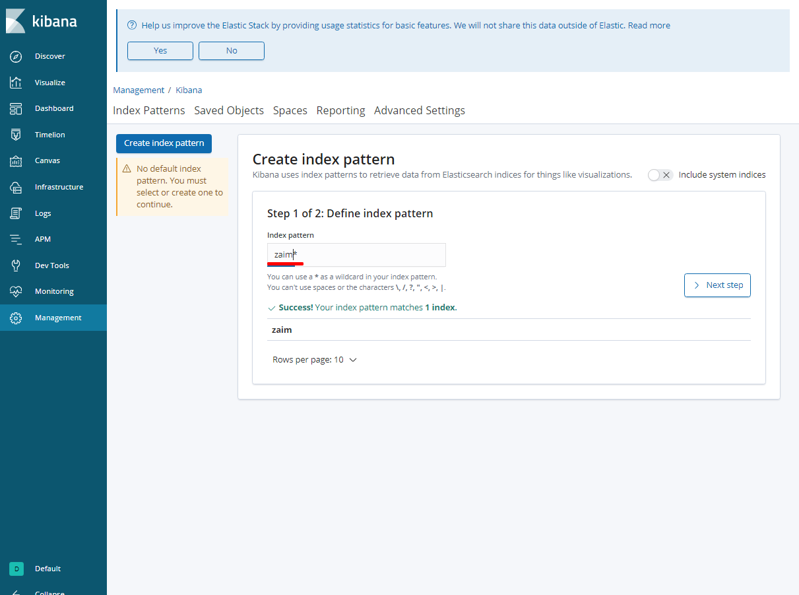

# Zaim Analysis Platform
 [inTheRye/zaim-analysis-platform](https://github.com/inTheRye/zaim-analysis-platform) をフォークして、自分用にアレンジしています。
 
 主な変更点

- Airflowのバージョンアップ: サポート外バージョン → 1.10.2 (ベースイメージ: [zhongjiajie](https://github.com/zhongjiajie)/[**docker-airflow**](https://github.com/zhongjiajie/docker-airflow))
- Airflowのアーキテクチャ変更: Celery → Local
- Elasticsearch/Kibanaのバージョンアップ: 5.5.2 → 6.6.2
- スクレイピングに用いるSeleniumで使用するブラウザの変更: PhantomJS (サポート外) → Chrome
- 上記に伴って、Selenium Standaloneサーバー用Dockerコンテナの追加
- ElasticsearchにZaimのデータをストアするときにドキュメントのインデックスの追加 (追加項目は下記の通り)
  - “payment_income”: 支払 (“payment”)、収入(“income”)、振替(“transfer”)
  - “year”: 年
  - “month”: 月
  

変更点の詳細は下記の私のブログでまとめていますのでこちらをご覧ください。

- [**家計簿アプリZaimデータの分析・可視化基盤を作った話**](http://hassiweb-programming.blogspot.com/2019/03/zaim-analysis-platform.html)

 

# Zaim Analysis Platform

zaim.net の家計簿データを定期的にスクレイピングし、Elasticsearchに保存し、Kibanaで描画するためのDockerコンテナ群で構成されるプラットフォームです。

## Getting Started

**Zaim用のコンフィグの作成**

自身のzaim.netのID、PASS、スクレイピングしたい家計簿データの開始日を書き込んだ `config.yml` ファイルを `airflow/app/` に作ります。

    $ echo 'ID: "your_user_id"' > airflow/app/config.yml
    $ echo 'PASS: "your_password"' >> airflow/app/config.yml
    $ echo 'START_DATE: "2018-1-1"' >> airflow/app/config.yml

**コンテナの実行**

docker-composeで必要なコンテナを起動します。

    $ docker-compose up -d

**Airflowでのジョブの設定**

http://localhost:8080 でAirflowにアクセスします。

上の赤枠のところが "Off" の状態ではタスクの実行は行われませんので "On" にします。

なお、初期設定では毎日0:00 JST (15:00 UTC)にZaimデータ更新のタスクを実行します。即座にデータ更新したい場合には赤枠の "Trigger Now" をクリックするとタスクが実行されます。

**kibanaの初期設定**

http://localhost:5601 でKibanaにアクセスします。
まず初めに、Kibanaで使用するIndex Patternを作る必要があります。
下のように **zaim*** を読み込ませれば、Elasticsearchからデータを読み出してIndex Patternを作ってくれます。

あとはKibanaのVizualizeから表示したい項目を適当に可視化します。

データがない！となっているときがありますが画面右上の検索期間短くなっている可能性があります。デフォルトでは直近15分になっていますので、データがありそうな期間に変更していください。

どのように可視化するのかわからない方は私のブログでいくつかの例をまとめていますのでそちらもご参考にしてください。

- [**家計簿アプリZaimデータの分析・可視化基盤でのKibanaを使った分析例**](https://hassiweb-programming.blogspot.com/2019/03/zaim-kibana-examples.html)

## License

This project is licensed under the Apache License 2.0 - see the [LICENSE](#) file for details

