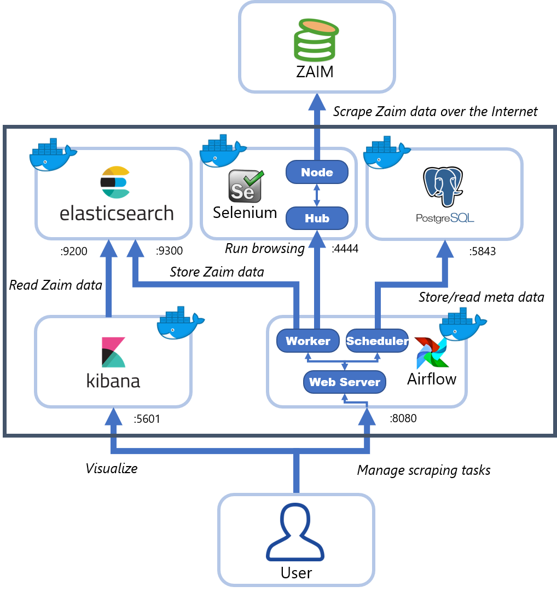
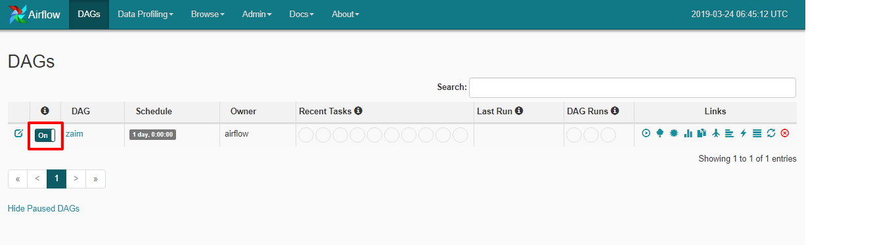
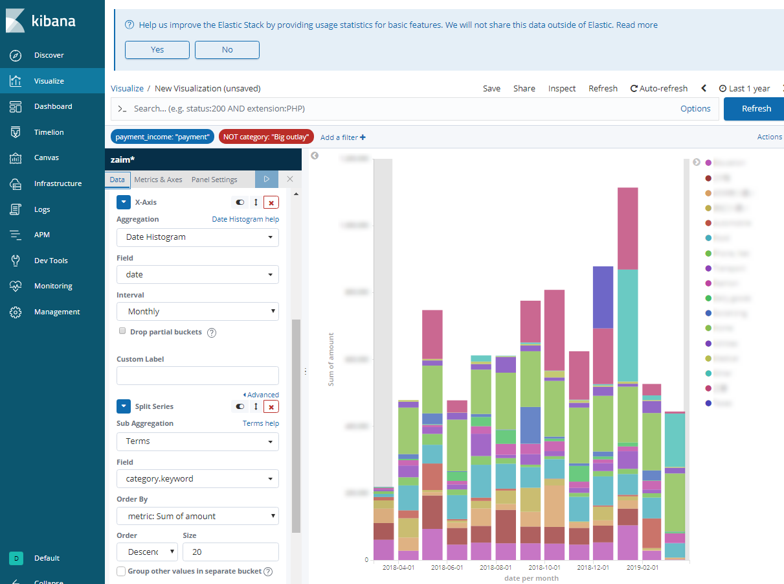

# Zaim Analysis Platform
 [inTheRye/zaim-analysis-platform](https://github.com/inTheRye/zaim-analysis-platform) をフォークして、自分用にアレンジしています。

 主な変更点

- Airflowのバージョンアップ: サポート外バージョン → 1.10.2 (ベースイメージ: [zhongjiajie](https://github.com/zhongjiajie)/[**docker-airflow**](https://github.com/zhongjiajie/docker-airflow))
- Airflowのアーキテクチャ変更: Celery → Local
- Elasticsearch/Kibanaのバージョンアップ: 5.5.2 → 6.6.2
- スクレイピングに用いるSeleniumで使用するブラウザの変更: PhantomJS (サポート外) → Chrome
- 上記に伴って、Selenium Standaloneサーバー用Dockerコンテナの追加
- ElasticsearchにZaimのデータをストアするときにドキュメントのインデックスの追加 (追加項目は下記の通り)
  - “payment_income”: 支払 (“payment”)、収入(“income”)、振替(“transfer”)
  - “year”: 年
  - “month”: 月

# Zaim Analysis Platform

zaim.net の家計簿データを定期的にスクレイプしてきて、Elasticsearchに突っ込んで、Kibanaで描画するためのDockerプラットフォームです。

## Getting Started

**Zaim用のコンフィグの作成**
自身のzaim.netのID、PASS、スクレイピングしたい家計簿データの開始日を書き込んだ `config.yml` ファイルを `airflow/app/` に作ります。

    $ echo 'ID: "your_user_id"' > airflow/app/config.yml
    $ echo 'PASS: "your_password"' >> airflow/app/config.yml
    $ echo 'START_DATE: "2018-1-1"' >> airflow/app/config.yml

**コンテナの実行**
docker-composeで必要なコンテナを起動します。

    $ docker-compose up -d

**Airflowでのジョブの設定**
http://localhost:8080 でAirflowにアクセスします。

初期設定では毎日0:00 UTC (09:00 JST)にデータの更新を行います。取得データが多い場合にはデータの取得に数分かかることがあります。

**kibanaの初期設定**
http://localhost:5601 でKibanaにアクセスします。
zaim* の Index Pattern を作って、あとは適当にビジュアライズします。

## License

This project is licensed under the Apache License 2.0 - see the [LICENSE](#) file for details
